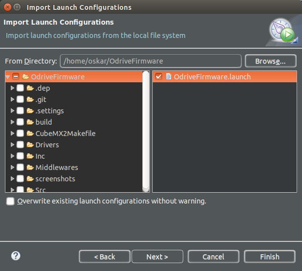

# Setting up Eclipse development environment

## Install
* Install [Eclipse IDE for C/C++ Developers](http://www.eclipse.org/downloads/packages/eclipse-ide-cc-developers/neon3)
* Install the [OpenOCD Eclipse plugin](http://gnuarmeclipse.github.io/plugins/install/)

## Import project
* File -> Import -> C/C++ -> Existing Code as Makefile Project
* Browse for existing code location, find the OdriveFirmware root.
* In the Toolchain options, select `Cross GCC`
* Hit Finish
* Build the project (press ctrl-B)

## Load the launch configuration
* File -> Import -> Run/Debug -> Launch Configurations -> Next
* Highlight (don't tick) the OdriveFirmare folder in the left column
* Tick OdriveFirmware.launch in the right column
* Hit Finish

## Launch!
* Make sure the programmer is connected to the board as per [Flashing the firmware](#flashing-the-firmware).
* Press the down-arrow of the debug symbol in the toolbar, and hit Debug Configurations
    * You can also hit Run -> Debug Configurations
* Highlight the debug configuration you imported, called OdriveFirmware. If you do not see the imported launch configuration rename your project to `ODriveFirmware` or edit the launch configuration to match your project name by unfiltering unavailable projects:

* Hit Debug
* Eclipse should flash the board for you and the program should start halted on the first instruction in `Main`
* Set beakpoints, step, hit Resume, etc.
* Make some cool features! ;D