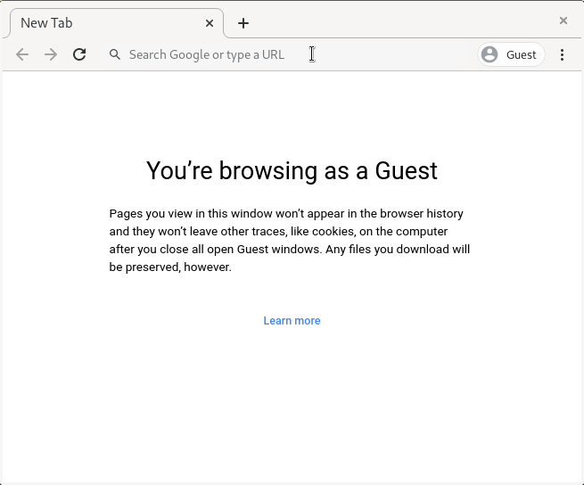

# fibre-js

This directory provides JavaScript bindings for [Fibre](https://github.com/samuelsadok/fibre). Its home is located [here](https://github.com/samuelsadok/fibre/tree/master/js). There's also a standalone repository for this directory [here](https://github.com/samuelsadok/fibre-js).

## Current Status

So far fibre-js was only tested to run in Chrome but it should work in any browser that [supports WebAssembly](https://caniuse.com/wasm).

fibre-js currently supports the following transport providers:

 - WebUSB ([Chrome and Edge only](https://caniuse.com/webusb))

## How to use

So you want your website or Electron App to connect to some resource(s) using Fibre. Let's start with a simple HTML scaffolding.

```HTML
<!doctype html>
<html>
    <head>
        <meta charset="utf-8">
        <title>fibre-js Test</title>
    </head>
    <body>
        <h1 id="statusText">not connected</h1>
        <button id="connectBtn" disabled>Connect...</button>
    </body>
</html>
```

Now, right before the closing `</body>`, insert a script tag to load and open fibre-js:

```HTML
<script type="module">
    import { fibreOpen } from './fibre.js';
    fibreOpen().then((libfibre) => {
        // fibre-js is ready to use!
    });
</script>
```

This will load the files `fibre.js`, `libfibre-wasm.js` and `libfibre-wasm.wasm` from the same directory the HTML file comes from so make sure those files exist.

Now that fibre-js is ready to use we can start discovering remote objects. For this we need to specify a filter string which tells Fibre where to look for objects. In this example we want to talk to a USB device that runs Fibre (more specfically an [ODrive](https://odriverobotics.com/)). The parameters we use here are something you can find out from reading the docs of your USB device or inspecting the device by using `lsusb` on a Linux or macOS computer.

```JS
const filter = 'usb:idVendor=0x1209,idProduct=0x0D32,bInterfaceClass=0,bInterfaceSubClass=1,bInterfaceProtocol=0';
const onFoundObject = async (obj) => {
    console.log("found an object!", obj);
    // TODO: do something with obj
}
libfibre.startDiscovery(filter, onFoundObject);
```

Now that we have the object we can start calling functions on it. Let's assume our object has the property `vbus_voltage`. In the `onFoundObject` handle, add:

```JS
while (true) {
    document.getElementById("statusText").innerHTML = "vbus_voltage: " + (await obj.vbus_voltage.read());
    await new Promise((resolve) => setTimeout(resolve, 100));
}
```

This will read the `vbus_voltage` property every 100ms and display the value on the web page.

Optionally you could add a callback to the `obj._onLost` promise in order to gracefully stop polling when the device disconnects.

Since we're using WebUSB in this example, there's one more thing left to do: The user needs to authorize the website (only once) to access the USB device. This must happen on a user gesture, which is why earlier we put a Connect-button into our HTML.

So directly after the call to `libfibre.startDiscovery()`, add:

```JS
document.getElementById("connectBtn").onclick = libfibre.usbDiscoverer.showDialog;
document.getElementById("connectBtn").removeAttribute('disabled');
```

That's it! You can now open the HTML page in the browser and should see something like this (using Chrome 86 on Linux):



Note how the user doesn't need to manually reselect the device after the website is reloaded. The website is now already authorized to access the device so Fibre immediately connects to it. The same is true when the device is unpluggend and replugged to the computer.

You can find the complete example code [here](example.html). A more elaborate example which can connect to multiple objects can be found here [here](multidevice_example.html).
