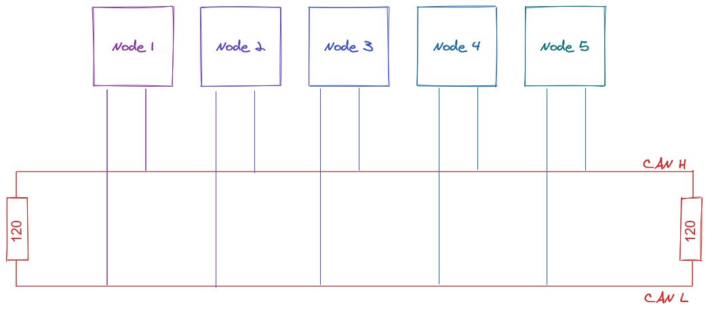

# CAN Bus Guide for ODrive

ODrive v3 supports CAN 2.0b. We've built a [simple protocol](can-protocol.md) (named CANSimple) so that most ODrive functions can be controlled without a full CAN Open or similar stack.  This guide is intended for beginners to set up CAN on the ODrive and on their host device.  We will be focusing on Raspberry Pi and Arduino-compatible devices using the MCP2515 CAN Controller.

## What is CAN bus?

Borrowing from [Wikipeda](https://en.wikipedia.org/wiki/CAN_bus):

> A Controller Area Network (CAN bus) is a robust vehicle bus standard designed to allow microcontrollers and devices to communicate with each other's applications without a host computer. It is a message-based protocol, designed originally for multiplex electrical wiring within automobiles to save on copper, but it can also be used in many other contexts. For each device, the data in a frame is transmitted sequentially but in such a way that if more than one device transmits at the same time, the highest priority device can continue while the others back off. Frames are received by all devices, including by the transmitting device.

In simple terms, CAN is a way of communicating between many devices over a single twisted pair of wires.  The signal is transmitted as the difference in voltage between the two wires (differential signalling), which makes it very robust against noise.  Instead of using a unique address (like I2C) or a select pin (like SPI), CAN *messages* have a unique ID that also acts as the priority.  At the beginning of a message frame, all devices talk and read at the same time.  As the message ID is transmitted, the lowest value "wins" and that message will be transmitted (ID **0** has the *highest* priority).  All other devices will wait for the next chance to send.  If two devices send the same message ID at the same time, they will conflict and a bus failure may occur.  Make sure your devices can never send the same message ID at the same time!



## Why use CAN?

CAN is convenient for its simple and robust Physical Layer (PHY) that requires only a twisted pair of wires and a 120ohm termination resistor at each end.  It has low jitter and low latency, because there is no host computer.  It is relatively fast (CAN 2.0b supports 1 Mbps).  Messages are easy to configure and load with data.  Transceivers and controllers are inexpensive and widely available, thanks to its use in automotive.

## Setting up CAN on ODrive

CANSimple breaks the CAN Message ID into two parts:  An axis ID and a command ID.  By default, CAN is enabled on the ODrive, where Axis 0 has ID 0, and Axis 1 has ID 1.  The ID of each axis should be unique; each should be set via `odrivetool` before connecting to the bus with the command:

`<odrv>.<axis>.config.can.node_id = <number>`

By default, ODrive supports a value up to 63 (`0x3F`).  See [can-protocol.md](can-protocol.md) for more information.

You should also set the CAN bus speed on ODrive with the command `<odrv>.can.config.baud_rate = <number>`

| Speed     | Value   |
| --------- | ------- |
| 125 kbps  | 125000  |
| 250 kbps  | 250000  |
| 500 kbps  | 500000  |
| 1000 kbps | 1000000 |

That's it!  You're ready to set up your host device.

### Example
```Python
odrv0.axis0.config.can.node_id = 0
odrv0.axis1.config.can.node_id = 1
odrv0.can.config.baud_rate = 250000
```

## Setting up a Raspberry Pi for CAN communications
First, you will need a CAN Hat for your Raspberry Pi.  We are using [this CAN hat](https://www.amazon.com/Raspberry-Long-Distance-Communication-Transceiver-SN65HVD230/dp/B07DQPYFYV).

Setting up the Raspberry Pi essentially involves the following:
1. Enable SPI communications to the MCP2515
2. Install `can-utils` with `apt-get install can-utils`
3. Creating a connection between your application and the `can0` socket

There are many tutorials for this process.  [This one is pretty good](https://www.hackster.io/youness/how-to-connect-raspberry-pi-to-can-bus-b60235), and [this recent forum post](https://www.raspberrypi.org/forums/viewtopic.php?t=296117) also works.  However, be careful.  You have to set the correct parameters for the particular CAN hat you're using!

1. Set the correct oscillator value

We configure the MCP2515 in section 2.2 of the tutorial, but the hat we recommend uses a 12MHz crystal instead of a 16 MHz crystal.  If you're not sure what value to use, the top of the [oscillator](https://en.wikipedia.org/wiki/Crystal_oscillator) will have the value printed on it in MHz.

My Settings:
```
dtparam=spi-on
dtoverlay=mcp2515-can0,oscillator=12000000,interrupt=25
dtoverlay=spi0-hw-cs
```

2. Use the correct CAN baud rate

By default, ODrive uses 250 kbps (250000) but the tutorial is using 500 kbps.  Make sure you use the value set earlier on the ODrive.

```
sudo ip link set can0 up type can bitrate 250000
```

### Wiring ODrive to CAN
The CANH and CANL pins on J2 are used for CAN communication.  Connect CANH to CANH on all other devices, and CANL to CANL.

If your ODrive is the "last" (furthest) device on the bus, you can use the on-board 120 Ohm termination resistor by switching the DIP switch to "CAN 120R".  Otherwise, add an external resistor.

### Verifying Communcation

By default, each ODrive axis will send a heartbeat message at 10Hz.  We can confirm our ODrive communication is working by starting the `can0` interface, and then reading from it:

```
sudo ip link set can0 up type can bitrate 250000
candump can0 -xct z -n 10
```

This will read the first 10 messages from the ODrive and stop.  If you'd like to see all messages, remove the `-n 10` part (hit CTRL+C to exit).  The other flags (x, c, t) are adding extra information, colouring, and a timestamp, respectively.

```
$ candump can0 -xct z -n 10
 (000.000000)  can0  RX - -  001   [8]  00 00 00 00 01 00 00 00
 (000.001995)  can0  RX - -  021   [8]  00 00 00 00 08 00 00 00
 (000.099978)  can0  RX - -  001   [8]  00 00 00 00 01 00 00 00
 (000.101963)  can0  RX - -  021   [8]  00 00 00 00 08 00 00 00
 (000.199988)  can0  RX - -  001   [8]  00 00 00 00 01 00 00 00
 (000.201980)  can0  RX - -  021   [8]  00 00 00 00 08 00 00 00
 (000.299986)  can0  RX - -  001   [8]  00 00 00 00 01 00 00 00
 (000.301976)  can0  RX - -  021   [8]  00 00 00 00 08 00 00 00
 (000.399986)  can0  RX - -  001   [8]  00 00 00 00 01 00 00 00
 (000.401972)  can0  RX - -  021   [8]  00 00 00 00 08 00 00 00
```

## Commanding the ODrive

Now that we've verified the communication is working, we can try commanding the ODrive.  Make sure your ODrive is configured and working properly over USB with `odrivetool` before continuing.  See the [Getting Started Guide](getting-started.md) for help with first-time configuration.

To move the ODrive, we use the command `Set Input Pos`, or cmd ID `0x00C`.