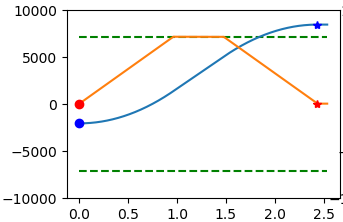

.. _control-modes-doc:

================================================================================
Control Modes
================================================================================

The default control mode is unfiltered position control in the absolute encoder reference frame. 
You may wish to use a controlled trajectory instead. 
Or you may wish to control position in a circular frame to allow continuous rotation forever without growing the numeric value of the setpoint too large.

You may also wish to control velocity (directly or with a ramping filter).
You can also directly control the current of the motor, which is proportional to torque.

.. contents::
   :depth: 1
   :local:

Filtered Position Control
--------------------------------------------------------------------------------

Asking the ODrive controller to go as hard as it can to raw setpoints may result in jerky movement. 
Even if you are using a planned trajectory generated from an external source, if that is sent at a modest frequency, the ODrive may chase each stair in the incoming staircase in a jerky way. 
In this case, a good starting point for tuning the filter bandwidth is to set it to one half of your setpoint command rate.

You can use the second order position filter in these cases.
Set the filter bandwidth [Hz]:

.. code:: iPython
    
    axis.controller.config.input_filter_bandwidth = 2.0

Activate the setpoint filter: 

.. code:: iPython
    
    axis.controller.config.input_mode = INPUT_MODE_POS_FILTER

You can now control the position with 

.. code:: iPython
    
    axis.controller.input_pos = 1

.. figure:: figures/secondOrderResponse.PNG
   :alt: secondOrderResponse

   Step response of a 1000 to 0 position input with a filter bandwidth of 1.0 Hz

Trajectory Control
--------------------------------------------------------------------------------

See the :ref:`Usage <usage>` section for usage details.

This mode lets you smoothly accelerate, coast, and decelerate the axis from one position to another. With raw position control, the controller simply tries to go to the setpoint as quickly as possible. Using a trajectory lets you tune the feedback gains more aggressively to reject disturbance, while keeping smooth motion.

    Position (blue) and velocity (orange) vs. time using trajectory control.

Parameters
~~~~~~~~~~~~~~~~~~~~~~~~~~~~~~~~~~~~~~~~~~~~~~~~~~~~~~~~~~~~~~~~~~~~~~~~~~~~~~~~

.. code:: iPython

    odrv0.axis0.trap_traj.config.vel_limit = <Float>

.. code:: iPython

    odrv0.axis0.trap_traj.config.accel_limit = <Float>

.. code:: iPython

    odrv0.axis0.trap_traj.config.decel_limit = <Float>

.. code:: iPython

    odrv0.axis0.controller.config.inertia = <Float>

* :code:`vel_limit` is the maximum planned trajectory speed.  This sets your coasting speed.
* :code:`accel_limit` is the maximum acceleration in turns / sec^2
* :code:`decel_limit` is the maximum deceleration in turns / sec^2
* :code:`controller.config.inertia` is a value which correlates acceleration (in turns / sec^2) and motor torque. It is 0 by default. It is optional, but can improve response of your system if correctly tuned. Keep in mind this will need to change with the load / mass of your system.

.. note:: All values should be strictly positive (>= 0).

Keep in mind that you must still set your safety limits as before.  It is recommended you set these a little higher ( > 10%) than the planner values, to give the controller enough control authority.

.. code:: iPython

    odrv0.axis0.motor.config.current_lim = <Float>

.. code:: iPython

    odrv0.axis0.controller.config.vel_limit = <Float>

.. _usage:

Usage
~~~~~~~~~~~~~~~~~~~~~~~~~~~~~~~~~~~~~~~~~~~~~~~~~~~~~~~~~~~~~~~~~~~~~~~~~~~~~~~~

Make sure you are in position control mode. To activate the trajectory module, set the input mode to trajectory:

.. code:: iPython

    odrv0.axis0.controller.config.input_mode = INPUT_MODE_TRAP_TRAJ

Simply send a position command to execute the move:

.. code:: iPython

    odrv0.axis0.controller.input_pos = <Float>

Use the :code:`move_incremental` function to move to a relative position.

.. code:: iPython

    odrv0.axis0.controller.move_incremental(pos_increment, from_goal_point)

To set the goal relative to the current actual position, use :code:`from_goal_point = False`
To set the goal relative to the previous destination, use :code:`from_goal_point = True`

You can also execute a move with the :ref:`appropriate ascii command <motor_traj-cmd>`.

Circular Position Control
--------------------------------------------------------------------------------

To enable Circular position control, set 

.. code:: iPython
    
    odrv0.axis0.controller.config.circular_setpoints = True

This mode is useful for continuous incremental position movement. 
For example a robot rolling indefinitely, or an extruder motor or conveyor belt moving with controlled increments indefinitely.
In the regular position mode, the :code:`input_pos` would grow to a very large value and would lose precision due to floating point rounding.

In this mode, the controller will try to track the position within only one turn of the motor. Specifically, :code:`input_pos` is expected in the range `[0, 1)`. 
If the :code:`input_pos` is incremented to outside this range (say via step/dir input), it is automatically wrapped around into the correct value.
Note that in this mode :code:`encoder.pos_circular` is used for feedback instead of :code:`encoder.pos_estimate`.

If you try to increment the axis with a large step in one go that exceeds `1` turn, the motor will go to the same angle around the wrong way. 
This is also the case if there is a large disturbance. If you have an application where you would like to handle larger steps, you can use a larger circular range. 
Set 

.. code:: iPython
    
    odrv0.axis0.controller.config.circular_setpoints_range = <N>
    

Choose N to give you an appropriate circular space for your application.

Velocity Control
--------------------------------------------------------------------------------

Set the control mode

.. code:: iPython
    
    odrv0.axis0.controller.config.control_mode = CONTROL_MODE_VELOCITY_CONTROL

You can now control the velocity [turn/s] with 

.. code:: iPython
    
    odrv0.axis0.controller.input_vel = 1

Ramped Velocity Control
--------------------------------------------------------------------------------

Set the control mode

.. code:: iPython

    odrv0.axis0.controller.config.control_mode = CONTROL_MODE_VELOCITY_CONTROL

Set the velocity ramp rate (acceleration in turn/s^2):

.. code:: iPython

    odrv0.axis0.controller.config.vel_ramp_rate = 0.5

Activate the ramped velocity mode: 

.. code:: iPython
    
    odrv0.axis0.controller.config.input_mode = INPUT_MODE_VEL_RAMP

You can now control the velocity (turn/s) with 

.. code:: iPython
    
    odrv0.axis0.controller.input_vel = 1

Torque Control
--------------------------------------------------------------------------------

Set the control mode

.. code:: iPython
    
    odrv0.axis0.controller.config.control_mode = CONTROL_MODE_TORQUE_CONTROL

Set the torque constant, e.g.:

.. code:: iPython
    
    # Approximately 8.23 / Kv where Kv is in the units [rpm / V]
    odrv0.axis0.motor.config.torque_constant = 8.23 / 150

You can now control the torque (Nm) with e.g.

.. code:: iPython

    odrv0.axis0.controller.input_torque = 0.1

.. note:: 
    For safety reasons, the torque mode velocity limiter is enabled by default.
    This works by reducing the torque of the motor according to :code:`vel_limit` and :code:`vel_gain`, as shown below.
    Please note that with the default settings, torque will limited even at 0 rpm.

    .. figure:: figures/torque_mode_vel_limit.png
        :alt: torque_mode_vel_limit

    The torque mode velocity limiter can be completely disabled by setting:

    .. code:: iPython
        
        odrv0.axis0.controller.enable_torque_mode_vel_limit = False
