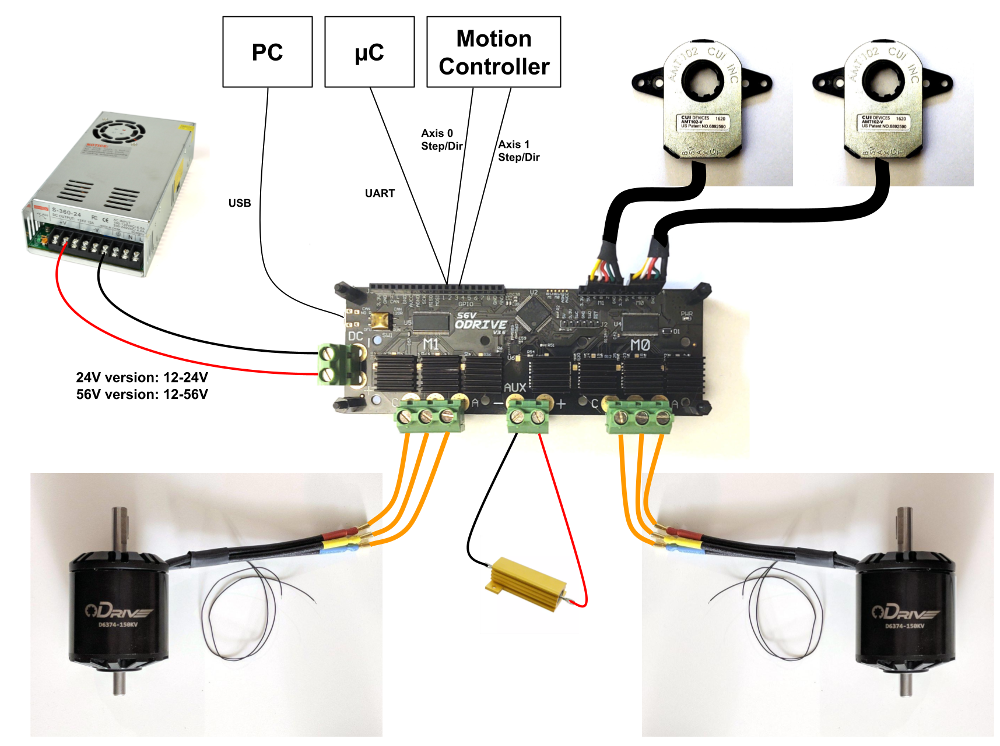

================================================================================
Getting Started
================================================================================

.. contents::
   :depth: 1
   :local:

Hardware Requirements
--------------------------------------------------------------------------------

**You will need**

* One or two `brushless motors <https://docs.google.com/spreadsheets/d/12vzz7XVEK6YNIOqH0jAz51F5VUpc-lJEs3mmkWP1H4Y>`__. It is fine, even recommended, to start testing with just a single motor and encoder.
* One or two `encoder(s) <https://docs.google.com/spreadsheets/d/1OBDwYrBb5zUPZLrhL98ezZbg94tUsZcdTuwiVNgVqpU>`__.
* A power supply (12V-24V for the 24V board variant, 12V-56V for the 56V board variant). A battery is also fine. Some advice on choosing a power supply can be found `here <https://things-in-motion.blogspot.com/2018/12/how-to-select-right-power-source-for.html>`__.

.. dropdown:: What voltage variant do I have?

    On all ODrives shipped July 2018 or after have a silkscreen label clearly indicating the voltage variant.

    ODrives before this may or may not have this label. If you don't have a label, then you can look at the bus capacitors (8 gray cylinder components on the underside of the board). If they read 470uF, you have a 24V version; if they read 120uF you have a 48V version.
 
* A power resistor. A good starting point would be the 50W resistor included with your ODrive.

.. dropdown:: Do I really need a power resistor? What values to choose?

    If you don't have a brake resistor, the ODrive will pump excess power back into the power supply during deceleration to achieve the desired deceleration torque. If your power supply doesn't eat that power (which it won't if it's not a battery), the bus voltage will inevitebly rise. If you're unlucky this will break the power supply.
    At some point, the ODrive's overvoltage protection will trip, after which both motors will be allowed to spin freely. Depending on your machine, this may or may not be a problem.

    The power resistor values you need depends on your motor setup, and peak/average deceleration power.

    To be on the safe side, think about what speed and current limits you want to set for the motor.

    When braking at max speed and with maximum motor current, the power that is dissipated in the power resistor can be calulated as: `P_brake = V_emf * I_motor` where `V_emf = motor_rpm / motor_kv`.

Wiring up the ODrive
~~~~~~~~~~~~~~~~~~~~~~~~~~~~~~~~~~~~~~~~~~~~~~~~~~~~~~~~~~~~~~~~~~~~~~~~~~~~~~~~

.. warning:: Firmware, software, and documentation is intended for use with ODrive motor controllers purchased from odriverobotics.com. ODrive Robotics does not sell products through any channel other than odriverobotics.com. We do not provide support for ODrives purchased elsewhere.

.. warning:: Make sure you have a good mechanical connection between the encoder and the motor, slip can cause disastrous oscillations or runaway.

All non-power I/O is 3.3V output and 5V tolerant on input, on ODrive v3.3 and newer.

Wiring up the motors
********************************************************************************

Connect the motor phases into the 3-phase screw terminals. It is not recommended to use a clip-on connector such as an alligator clip, as this can cause issues with the phase resistance/inductance measurements. 

Wiring up the encoders
********************************************************************************

Connect the encoder(s) to J4. The A,B phases are required, and the Z (index pulse) is optional. The A,B and Z lines have 3.3k pull up resistors, for use with open-drain encoder outputs. For single ended push-pull signals with weak drive current (\<4mA), you may want to desolder the pull-ups.

Safety & Power UP
********************************************************************************
.. warning:: Always think safety before powering up the ODrive if motors are attached. Consider what might happen if the motor spins as soon as power is applied.

* Unlike some devices, the ODrive does not recieve power over the USB port so the 24/56 volt power input is required even just to communicate with it using USB. It is ok to power up the ODrive before or after connecting the USB cable.

* To power up the ODrive, connect the power source to the DC terminals. Make sure to pay attention to the polarity. Try to connect the power source first and then turn it on to avoid inrush current. If this can't be avoided then a small spark is normal. This is caused by the capacitors charging up.

* Make sure to avoid a ground loop! See the :ref:`ground loop page <ground-loops>` for details.

.. _install-odrivetool:

Downloading and Installing :code:`odriveool`
~~~~~~~~~~~~~~~~~~~~~~~~~~~~~~~~~~~~~~~~~~~~~~~~~~~~~~~~~~~~~~~~~~~~~~~~~~~~~~~~

Most instructions in this guide refer to a utility called `odrivetool`, so you should install that first.

.. tabs::
    .. tab:: Windows

        #. Install Python 3

            We recommend the Anaconda distribution because it packs a lot of useful scientific tools, however you can also install the standalone python.
            
            * **Anaconda**: Download the installer from `here <https://www.anaconda.com/download/#windows>`__. Execute the downloaded file and follow the instructions.
            * **Standalone Python**: Download the installer for 3.8.6 from `here <https://www.python.org/downloads/release/python-386/>`__. Execute the downloaded file and follow the instructions.  As of Oct 2020, Matplotlib (required by odrivetool) had not been updated to work with 3.9, so please use 3.8.6.
            * If you have Python 2 installed alongside Python 3, replace :code:`pip` by :code:`C:\Users\YOUR_USERNAME\AppData\Local\Programs\Python\Python36-32\Scripts\pip`. If you have trouble with this step then refer to `this walkthrough <https://www.youtube.com/watch?v=jnpC_Ib_lbc>`__.

        #. Launch the command prompt.

            * **Anaconda**: In the start menu, type :code:`Anaconda Prompt` :kbd:`Enter`
            * **Standalone Python** In the start menu, type :code:`cmd` :kbd:`Enter`

        #. Install odrivetool by running      

            .. code-block:: Bash
                
                pip install --upgrade odrive

    .. tab:: macOS

        We are going to run the following commands for installation in Terminal.

        #. If you don't already have it, install homebrew: 

            .. code-block:: Bash

                /usr/bin/ruby -e "$(curl -fsSL https://raw.githubusercontent.com/Homebrew/install/master/install)"

        #. Install python:

            .. code-block:: Bash

                brew install python

            .. note::
                If you get an error saying `python 2.7.* is already installed`, then upgrade to Python 3 by running:  

                .. code-block:: Bash

                    brew upgrade python

        #. Install libusb:

            libusb is required for odrivetool to communicate with the ODrive:
        
            .. code-block:: Bash

                brew install libusb

            .. _installodrivetool:

        #. Install odrivetool:

            Now that you have Python 3 and all the package managers, run:
        
            .. code-block:: Bash

                pip3 install --upgrade odrive

        **Troubleshooting**

        #. Permission Errors:

            Just run the previous command in sudo

            .. code-block:: Bash

                sudo pip3 install --upgrade odrive
                

        #. Dependency Errors:

            If the installer doesn't complete and you get a dependency error (Ex. :code:`No module...`` or :code:`module_name not found`), run the command
            
            .. code-block:: Bash

                sudo pip3 install module_name

            and try to :ref:`install odrivetool <installodrivetool>` again.

        #. Other Install Errors: 

            If the installer fails at installing dependencies, try

            .. code-block:: Bash

                sudo pip3 install odrive --no-deps

            .. warning:: If you do this, brace yourself for runtime errors when you run :code:`odrivetool` (the basic functionality should work though).

    .. tab:: Linux

        #. `Install Python 3 <https://www.python.org/downloads/>`__. 
        
            For example, on Ubuntu, run

            .. code-block:: Bash

                sudo apt install python3 python3-pip

        #. Install odrivetool by opening a terminal and typing

            .. code-block:: Bash

                sudo pip3 install --upgrade odrive

            .. note:: This should automatically add the udev rules. If this fails for some reason you can add them manually:

                .. code-block:: Bash

                    echo 'SUBSYSTEM=="usb", ATTR{idVendor}=="1209", ATTR{idProduct}=="0d[0-9][0-9]", MODE="0666"' | sudo tee /etc/udev/rules.d/91-odrive.rules
                    sudo udevadm control --reload-rules
                    sudo udevadm trigger

        .. admonition:: **Ubuntu**, **Raspbian**

            If you can't invoke :code:`odrivetool` at this point, try adding :code:`~/.local/bin` to your :code:`$PATH`, `see related bug <https://unix.stackexchange.com/a/392710/176715>`__. 
            This is done for example by running :code:`nano ~/.bashrc`, scrolling to the bottom, pasting :code:`export PATH=$PATH:~/.local/bin`, and then saving and closing, then close and reopen the terminal window.

Firmware
~~~~~~~~~~~~~~~~~~~~~~~~~~~~~~~~~~~~~~~~~~~~~~~~~~~~~~~~~~~~~~~~~~~~~~~~~~~~~~~~

To simplify the start up procedure we suggest using the latest firmware verion. Please follow the instructions :ref:`here <firmware-update>` to make sure your firmware is up to date.

.. admonition:: **ODrive v3.5 and later**

    Your board should come preflashed with the latest firmware. If you run into problems, check your firmware version and upgrade if possible.

.. admonition:: **ODrive v3.4 and earlier**

    Your board does **not** come preflashed with any firmware. Follow the instructions :ref:`here <st-link-flash>` on the ST Link procedure before you continue.

.. _odrivetool-startup:

Start :code:`odrivetool`
--------------------------------------------------------------------------------

* To launch the main interactive ODrive tool, type :code:`odrivetool` and :kbd:`Enter`. 
* Connect your ODrive and wait for the tool to find it. If it dos not connect after a few seconds refer to the :ref:`troubleshooting guide <troubleshooting>`. 
* Now you can, for instance type :code:`odrv0.vbus_voltage` :kbd:`Enter` to inspect the boards main supply voltage.

It should look something like this:

.. code:: iPython

    ODrive control utility v0.5.4
    Please connect your ODrive.
    Type help() for help.

    Connected to ODrive 306A396A3235 as odrv0
    In [1]: odrv0.vbus_voltage
    Out[1]: 11.97055721282959

The tool you're looking at is a fully capable Python command prompt, so you can type any valid python code.
You can read more about :code:`odrivetool` :ref:`here <odrivetool-doc>`.

.. _motor-config:

Motor Configuration
--------------------------------------------------------------------------------

.. warning:: Read this section carefully, else you risk breaking something.

Configuration of a motor is done within the :code:`odrivetool` console, type :code:`odrivetool` and :kbd:`Enter` to launch. Make sure you have completed :ref:` Start odrivetool <odrivetool-startup>` before continuing.

This section assumes that the motor being configured is connected to the ODrive as M0 (:code:`axis0`). To configure M1, simply replace all instances of :code:`axis0` with :code:`axis1`. 

If any of the following steps fail, print the errors by running :code:`dump_errors(odrv0)` and refer to the :ref:`Error codes <error-codes>` section for debugging.
Once the error(s) have been identified and corrected, run :code:`odrv0.clear_errors()` to clear them before moving forward.

.. admonition:: Working on a hoverboard?

    There is a :ref:`separate guide <hoverboard-doc>` specifically for hoverboard motors

Setting the Limits
~~~~~~~~~~~~~~~~~~~~~~~~~~~~~~~~~~~~~~~~~~~~~~~~~~~~~~~~~~~~~~~~~~~~~~~~~~~~~~~~

With :code:`odrivetool` open you can assign variables directly by name.
For instance, to set the current limit of M0 to 10A you would type

.. code:: iPython

    odrv0.axis0.motor.config.current_lim = 10

Current limit
*********************************************************************************

    The default current limit, for safety reasons, is set to 10A. This is quite weak, but good for making sure the drive is stable. 
    To change the current limit, 

    .. code:: iPython

        odrv0.axis0.motor.config.current_lim = val

    Once you have tuned the ODrive, you can increase this to 60A to increase performance.   

    .. dropdown:: Need more than 60A?

        For current limits above 60A, you must change the current amplifier gains. 
        You do this by requesting a different current range. i.e. for 90A on M0

        .. code:: iPython

            odrv0.axis0.motor.config.requested_current_range = 90   

        
        then :ref:`save the configuration and reboot <save-config>` as the gains are written out to the DRV (MOSFET driver) only during startup.
    
    .. Note:: The motor current and the current drawn from the power supply is not the same in general. You should not look at the power supply current to see what is going on with the motor current.*

        .. dropdown:: Ok, so tell me how it actually works then...

            The current in the motor is only connected to the current in the power supply `sometimes` and other times it just cycles out of one phase and back in the other. 
            This is what the modulation magnitude is (sometimes people call this duty cycle, but that's a bit confusing because we use `SVM <https://www.mathworks.com/solutions/power-electronics-control/space-vector-modulation.html>`__ not straight PWM). 
            When the modulation magnitude is 0, the average voltage seen across the motor phases is 0, and the motor current is never connected to the power supply. 
            When the magnitude is 100%, it is always connected, and at 50% it's connected half the time, and cycled in just the motor half the time.

            The largest effect on modulation magnitude is speed. There are other smaller factors, but in general: if the motor is still it's not unreasonable to have 50A in the motor from 5A on the power supply. 
            When the motor is spinning close to top speed, the power supply current and the motor current will be somewhat close to each other.

Velocity limit
*********************************************************************************

The motor will be limited to this speed in [turn/s]. Again the default value is quite slow.

.. code:: iPython
    
    odrv0.axis0.controller.config.vel_limit = 2

Calibration Current
*********************************************************************************

You can change :code:`odrv0.axis0.motor.config.calibration_current` [A] to the largest value you feel comfortable leaving running through the motor continuously when the motor is stationary. 
If you are using a small motor (i.e. 15A current rated) you may need to reduce :code:`calibration_current` to a value smaller than the default.

Setting Other Hardware Parameters
~~~~~~~~~~~~~~~~~~~~~~~~~~~~~~~~~~~~~~~~~~~~~~~~~~~~~~~~~~~~~~~~~~~~~~~~~~~~~~~~

Enable Brake Resistor
*********************************************************************************

Set this to `True` if using a brake resistor. You need to :ref:`save the configuration and reboot <save-config>` the ODrive for this to take effect.

.. code:: iPython

    odrv0.config.enable_brake_resistor

Brake Resistor Value
*********************************************************************************

This is the resistance [Ohms] of the brake resistor. You can leave this at the default setting if you are not using a brake resistor.

.. code:: iPython
    
    odrv0.config.brake_resistance

.. note:: There may be some extra resistance in your wiring and in the screw terminals, so if you are getting issues while braking you may want to increase this parameter by around 0.05 ohm.

Negative Current
*********************************************************************************

This is the amount of current [Amps] allowed to flow back into the power supply. The convention is that it is negative. By default, it is set to a conservative value of 10mA. If you are using a brake resistor and getting :code:`DC_BUS_OVER_REGEN_CURRENT` errors, raise it slightly. 
If you are not using a brake resistor and you intend to send braking current back to the power supply, set this to a safe level for your power source.

.. code:: iPython

    odrv0.config.dc_max_negative_current

Pole Pairs
*********************************************************************************

This is the number of **magnet poles** in the rotor, **divided by two**. To find this, you can simply count the number of permanent magnets in the rotor, if you can see them.

.. code:: iPython
    
    odrv0.axis0.motor.config.pole_pairs

.. Note:: This is **not** the same as the number of coils in the stator.

A good way to find the number of pole pairs is with a current limited power supply. Connect any two of the three phases to a power supply outputting around 2A, spin the motor by hand, and count the number of detents. 
This will be the number of pole pairs. If you can't distinguish the detents from the normal cogging present when the motor is disconnected, increase the current.
Another way is sliding a loose magnet in your hand around the rotor, and counting how many times it stops. This will be the number of `pole pairs`. If you use a ferrous piece of metal instead of a magnet, you will get the number of `magnet poles`.

Torque Constant
*********************************************************************************

This is the ratio of torque produced by the motor per Amp of current delivered to the motor. This should be set to **8.27 / (motor KV)**.

.. code:: iPython
    
    odrv0.axis0.motor.config.torque_constant

If you decide that you would rather command torque in units of Amps, you could simply set the torque constant to 1.

Motor Type
*********************************************************************************

This is the type of motor being used. Currently two types of motors are supported: High-current motors (`MOTOR_TYPE_HIGH_CURRENT, [0]`) and gimbal motors (`MOTOR_TYPE_GIMBAL, [2]`).

.. code:: iPython

    odrv0.axis0.motor.config.motor_type

.. dropdown:: Which :code:`motor_type` to choose?

    If you're using a regular hobby brushless motor like `this <https://hobbyking.com/en_us/turnigy-aerodrive-sk3-5065-236kv-brushless-outrunner-motor.html>`__ one, you should set :code:`motor_mode` to :code:`MOTOR_TYPE_HIGH_CURRENT`. 
    For low-current gimbal motors like `this <https://hobbyking.com/en_us/turnigy-hd-5208-brushless-gimbal-motor-bldc.html>`__ one, you should choose :code:`MOTOR_TYPE_GIMBAL`. Do not use :code:`MOTOR_TYPE_GIMBAL` on a motor that is not a gimbal motor, as it may overheat the motor or the ODrive.

    **Further detail:**
    If 100's of mA of current noise is "small" for you, you can choose :code:`MOTOR_TYPE_HIGH_CURRENT`.
    If 100's of mA of current noise is "large" for you, and you do not intend to spin the motor very fast (Ω * L << R), and the motor is fairly large resistance (1 ohm or larger), you can chose :code:`MOTOR_TYPE_GIMBAL`.
    If 100's of mA current noise is "large" for you, `and` you intend to spin the motor fast, then you need to replace the shunt resistors on the ODrive.

.. note:: 
    When using gimbal motors, :code:`current_lim` `and` :code:`calibration_current` actually mean `voltage limit` and `calibration voltage` respectively, since we don't use current feedback. 
    This means that if you set it to 10, it means 10V, despite the name of the parameter.

Motor Thermistor
*********************************************************************************

If using motor thermistor please see the :ref:`thermistors <thermistor-doc>` page for setup.

Encoder Configuration
--------------------------------------------------------------------------------

With Encoder
~~~~~~~~~~~~~~~~~~~~~~~~~~~~~~~~~~~~~~~~~~~~~~~~~~~~~~~~~~~~~~~~~~~~~~~~~~~~~~~~

Set the encoder count per revolution [CPR] value

.. code:: iPython
    
    odrv0.axis0.encoder.config.cpr

This is 4x the Pulse Per Revolution (PPR) value. Usually this is indicated in the datasheet of your encoder.
If you purchased an encoder from our shop, you can find the parameters `here <https://docs.google.com/spreadsheets/d/1OBDwYrBb5zUPZLrhL98ezZbg94tUsZcdTuwiVNgVqpU/edit#gid=0>`__.

Without Encoder
~~~~~~~~~~~~~~~~~~~~~~~~~~~~~~~~~~~~~~~~~~~~~~~~~~~~~~~~~~~~~~~~~~~~~~~~~~~~~~~~

* If you wish to run in sensorless mode, please see :ref:`Setting up sensorless. <sensorless-setup>`
* If you are using hall sensor feedback, please see the :ref:`hoverboard motor example <hoverboard-doc>`.

.. _save-config:

Save Configuration
--------------------------------------------------------------------------------

You can save all :code:`.config` parameters to persistent memory so the ODrive remembers them between power cycles. This will reboot the board.

.. code:: iPython
    
    odrv0.save_configuration() 

Position control of M0
--------------------------------------------------------------------------------
Let's get motor 0 up and running. The procedure for motor 1 is exactly the same, so feel free to substitute :code:`axis1` wherever it says :code:`axis0`.

    #. Start the calibratrion sequence by entering

    .. code:: iPython
        
        odrv0.axis0.requested_state = AXIS_STATE_FULL_CALIBRATION_SEQUENCE
        
    and press :kbd:`Enter`. 

    After about 2 seconds you should hear a beep. Then the motor will turn slowly in one direction for a few seconds, then back in the other direction.

    .. dropdown:: What's the point of this?

        This procedure first measures your motor's electrical properties (namely phase resistance and phase inductance) and then the offset between the motor's electrical phase and the encoder position.

    The startup procedure is demonstrated `here <https://www.youtube.com/watch?v=VCX1bA2xnuY>`__.

    .. note::
        The rotor must be allowed to rotate without any biased load during startup. 
        That means mass and weak friction loads are fine, but gravity or spring loads are not okay. 
        Also note that in the video, the motors spin after initialization, but in the current software the default behaviour is not like that.

    .. dropdown:: Help, something isn't working!
    
        Check the encoder wiring and that the encoder is firmly connected to the motor. Check the value of :code:`dump_errors(odrv0)` and then refer to the :ref:`error code documentation <error-codes>` for details.
        Once you understand the error and have fixed its cause, you may clear the error state with (:code:`odrv0.clear_errors()` :kbd:`Enter`) and retry.

    #. Start closed loop control by typing

        .. code:: iPython
            
            odrv0.axis0.requested_state = AXIS_STATE_CLOSED_LOOP_CONTROL
            
        and press :kbd:`Enter`. From now on the ODrive will try to hold the motor's position. If you try to turn it by hand, it will fight you gently. That is unless you bump up :code:`odrv0.axis0.motor.config.current_lim`, in which case it will fight you more fiercely. 
        If the motor begins to vibrate either immediately or after being disturbed you will need to :ref:`lower the controller gains <control-tuning>`.

    #. Send the motor a new position setpoint with 

        .. code:: iPython

            odrv0.axis0.controller.input_pos = 1
            
        The units are in turns.

    #. At this point you will probably want to :ref:`Properly tune <control-doc>` the motor controller in order to maximize system performance.

Other Control Modes
~~~~~~~~~~~~~~~~~~~~~~~~~~~~~~~~~~~~~~~~~~~~~~~~~~~~~~~~~~~~~~~~~~~~~~~~~~~~~~~~

The default control mode is unfiltered position control in the absolute encoder reference frame. 
The ODrive can be used with a variety of control modes, to learn more, check out the :ref:`control modes <control-modes-doc>` documentation page.

Watchdog Timer
--------------------------------------------------------------------------------

Each axis has a configurable watchdog timer that can stop the motors if the
control connection to the ODrive is interrupted.

Each axis has a configurable watchdog timeout: :code:`axis.config.watchdog_timeout`,
measured in seconds. Set 

.. code:: iPython
    
    axis.config.enable_watchdog = True
    
to turn on this feature.

The watchdog is fed using the :code:`axis.watchdog_feed()` method of each axis. 
Some :ref:`ascii commands <acsii-cmd-ref>` and most CANSimple commands feed the watchdog automatically.

What's next?
--------------------------------------------------------------------------------

You can now:
* :ref:`Properly tune <control-doc>` the motor controller to unlock the full potential of the ODrive.
* See what other :ref:`commands and parameters <commands-doc>` are available, in order to better control the ODrive.
* Control the ODrive from your own program or hook it up to an existing system through one of it's :ref:`interfaces <pinout-chart>`.
* See how you can improve the behavior during the startup procedure, like :ref:`bypassing encoder calibration <encoder-with-index-signal>`.
* The CAN communication is the most reliable way of talking to ODrive in a real application.  Check out the :ref:`CAN Guide <can-guide>` and :ref:`CAN Protocol <can-protocol>`

If you have any issues or any questions please get in touch. The `ODrive Community <https://discourse.odriverobotics.com/>`__ warmly welcomes you.

Upgrading from 0.4.12
--------------------------------------------------------------------------------

A new version (0.5.4) of ODrive firmware has released, complete with a new odrivetool. 
Follow the installation instructions, making sure to add the :code:`--upgrade` flag to pip commands, and check out the `Changelog <https://github.com/odriverobotics/ODrive/blob/master/CHANGELOG.md>`_ for changes!

The odrivetool will stage and restore your configuration.  
This probably isn't wise for the 0.4.12 -> 0.5.1 upgrade, so we suggest using :code:`odrv0.erase_configuration()` immediately after connecting the first time.
